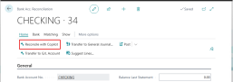
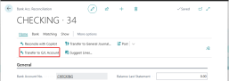
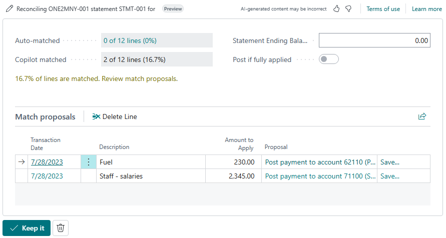

# Reconcile bank accounts with Copilot (preview)

[!INCLUDE[production-ready-preview-dynamics365](includes/production-ready-preview-dynamics365.md)]

This article explains how to use bank account reconciliation assist to help you reconcile bank transactions with ledger entries in Business Central.

## About bank account reconciliation assist

Bank account reconciliation assist is a set of AI-powered features that assist you in reconciling bank accounts. Bank account reconciliation assist offers you two distinct tasks through Copilot:

- Improved matching of transactions with ledger entries

   You might already be familiar with the **Match Automatically** action on **Bank Acc. Reconciliation** page that automatically matches most bank transactions with ledger entries. We refer to this operation as *automatch*. Although automatch works well, the algorithms it uses can sometimes result in many unmatched transactions. Copilot uses AI technology to inspect remaining transactions and identify more matches, based on the dates, amounts, and descriptions. For example, if multiple invoices were paid as one lump sum by a customer, Copilot reconciles the single bank statement line with the multiple invoice ledger entries.
   
   Go to [Reconcile bank accounts with Copilot](#reconcile-bank-accounts-with-copilot).

- Suggested general ledger accounts

  For residual bank transactions that can't be matched to any ledger entries, Copilot compares the transaction description with G/L account names, suggesting the most likely G/L account to post to. For example, Copilot might suggest that transactions with the narrative "Fuel Stop 24" be posted to the "Transportation" account.
  
   Go to [Transfer unmatched bank transactions to suggested general ledger accounts](#transfer-unmatched-bank-transactions-to-suggested-general-ledger-accounts).

   
## Prerequisites

- Bank account reconciliation assist is enabled and activated. This task is done by an administrator. [Learn more about enabling Copilot and AI capabilities](enable-ai.md).
- Bank accounts in Business Central that you want to reconcile are linked to an online bank account or set up with bank statement import format. 
- You're familiar with bank account reconciliation in Business Central as described in [Reconcile Bank Accounts](bank-how-reconcile-bank-accounts-separately.md). 

<!--H2s. Required. A how-to article explains how to do a task. The bulk of each H2 should be a procedure.-->
## Reconcile bank accounts with Copilot

<!-- Similar to the **Match Automatically** capability on the **Bank Acc. Reconciliation** page, Bank account reconciliation assist can also automatically matches transactions in banks statements with bank entries. The difference is that **Match Automatically** uses a native rules-based algorithm, while Bank account reconciliation assist is based AI technology though Copilot. Bank account reconciliation assist is intended to supplement the **Match Automatically** capability. While **Match Automatically** is fairly successful at matching transactions, there are some instances where it can't&mdash;which is where Bank account reconciliation assist comes. By using the **Reconcile with Copilot** action on **Bank Acc. Reconciliation** page, you can find even more matches.-->

Copilot in bank account reconciliation is intended to be used as a supplement to the automatch operation. For this reason, when you use Copilot, the automatch operation runs first to make the initial matches. Then, Copilot runs to try to match transactions that the automatch operation didn't handle.   

There are two approaches to reconciling bank accounts with Copilot. You can use Copilot to start a new reconciliation on a bank account, directly from **Bank Account Reconciliation** list, or you can use Copilot on a new or existing reconciliation on the **Bank Acc. Reconciliation** card.

# [From the bank account reconciliation list](#tab/fromlist) 

With this approach, you create and reconcile a new bank account reconciliation from scratch. This approach requires you to select the bank account and import the bank statement file, if the bank account isn't linked to an online account.

1. Select the  icon, enter **Bank Account Reconciliations**, and then choose the related link. 
1. Select the **Reconcile with Copilot** action to open the **Reconcile with Copilot** window.
1. Set **Perform reconciliation for this bank account** field to the bank account that you want to reconcile.

    
 
1. If the selected bank account isn't linked to an online bank account, you must import the bank statement file. To import the file, either select the value in the **Use transaction data from** field or select the paper clip button next the **Generate** button. Then, use the **Select the file to import** to import the bank statement file by either dragging it from your device or browsing your device.
1. To reconcile with Copilot, select **Generate**.

   Copilot starts generating proposed matches. When it's completed, the Reconcile with Copilot window opens the results of the matching process.

1. Review the proposed matches as described in the following section.

# [From a bank account reconciliation card](#tab/fromcard) 

With this approach, you use Copilot either on a new bank account reconciliation that you create manually or by editing an existing reconciliation. 

1. Select the  icon, enter **Bank Account Reconciliations**, and then choose the related link. 
1. Do one of the following steps:

   - Select **New** to start a new reconciliation. 
   - Select and open an existing reconciliation from the list.
1. In the **Bank Acc. Reconciliation** card, select **Reconcile with Copilot**

    

   Copilot starts generating proposed matches. When it's completed, the **Reconcile with Copilot** window opens the results of the matching process. 

1. Review the proposed matches as described in the following section. 
---

### Review, save, or discard proposed matches

After you run Copilot, the **Reconcile with Copilot** window shows the detailed results, including any proposed matches. At this point, no matches proposed by Copilot have been saved, so it provides you with opportunity inspect the proposals and save or discard as you like.

 

The Copilot window is divided into two sections. The upper section provides some general details about result, as described in the following table.  The lower **Matched Proposal** section lists the matches suggested by Copilot.

|Field|Description|
|-|-|
|Auto-matched|Specifies how many lines in the bank statement matched by the automatch operation. Select the value to view the reconciliation card.  |
|Copilot matched|Specifies how many lines in the bank statement have matches proposed by Copilot. You can view details of the matches in the **Matches Proposed** section.|
|Statement Ending Balance|Specifies the ending balance shown on the bank's statement that you're reconciling with|
|Post if fully applied|Turn on this switch if you want to automatically post the bank account reconciliation when all lines (100%) are matched and you've selected **Keep it**.|

#### Save or discard proposed matches

In the **Matched Proposals** section, review the suggested matches line by line, and then take the appropriate action:

- To discard a single proposed match, select it in the list, and then select the **Delete Line** action.

- To discard all proposed matches and close the Copilot window, select the discard button (trash can)  next to the **Keep it** button at the bottom of the window.

   > [!NOTE]
   > If you started Copilot from the **Bank Acc. Reconciliation** card for a new or existing reconciliation, only the Copilot proposed matches are deleted. The matches made by the automatch operation are already saved.
   > 
   > If you started Copilot from the **Bank Account Reconciliations** list, nothing is saved, including the imported bank statement lines, automatches, and Copilot proposed matches.

- To post the fully matched reconciliation automatically when you save it, turn on the **Post if fully applied** switch.  
- To save the matches currently shown in the Copilot window, select **Keep it**.

## Transfer unmatched bank transactions to suggested general ledger accounts

In this section, you learn how to use Copilot to transfer unreconciled bank account statements from the bank account ledger to a general ledger account. This task can only be done from an existing reconciliation. 

1. Go to the **Bank Account Reconciliations** list, and open the existing reconciliation that includes the unreconciled lines.

   Start by opening an existing bank account reconciliation. This step provides you with a clear view of any unreconciled bank statement lines that need to be transferred to the general ledger account.

2. In the **Bank statement lines** pane, identify the unmatched bank statement lines pane and select one or more lines that you want to reconcile.

   These lines are the statement lines that Copilot focuses on for transfer to the general ledger account.

3. Select **Transfer to G/L Account** to start the process.

    

   This step prompts Copilot to start generating proposals for the transfer.

4. Once Copilot has finished generating proposals, the **Copilot G/L Account Transfer Proposals** window opens.

   This window displays the proposals in the **Matched Proposal** section. The experience is similar to reconcile with Copilot.

    

5. Review each proposal line by line to ensure the accuracy of the suggested transfers.

   - If you drill down on the proposal by selecting it in the list, you're taken to a list of accounts. From here, you can choose another account. This kind of manual correction is only possible when using the **Transfer to G/L Account** flow, not in the matching flow. 
   - If you select **Save...** next to a proposal, you can add the mapping to the **Text-to-Account Mapping** page, so the next time this text appears while matching, it will be mapped to the proposed account.

6. Discard or save proposals.

   - If you want to discard a specific proposal, select it in the list and then select **Delete Line**. To discard all proposals and exit Copilot, select the discard button (trash can)  next to the **Keep it** button at the bottom of the window.
   
   - If the proposals meet your requirements and you want to save them, select **Keep It**. 

      This step confirms the transfer of the currently selected proposals from the bank account ledger to the general ledger account. It posts new payments to the proposed G/L Accounts and applies corresponding lines to the resulting bank account ledger entries.

## Next steps

[Validate your bank account reconciliation](bank-how-reconcile-bank-accounts-separately.md#validate-your-bank-reconciliation)  

## See also
[Responsible AI FAQ for bank reconciliation assist](faqs-bank-reconciliation.md)  
[Setting Up Banking](bank-setup-banking.md)  
[Reconcile Bank Accounts](bank-how-reconcile-bank-accounts-separately.md)  
[Applying Payments Automatically and Reconciling Bank Accounts](receivables-apply-payments-auto-reconcile-bank-accounts.md) 
